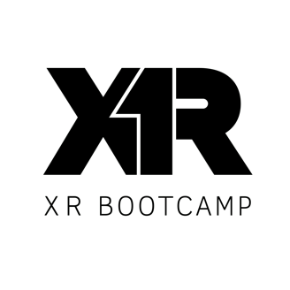

<!-- PROJECT LOGO -->
 

  

  <h3 align="center">Interactions SDK quick start by XR Bootcamp</h3>

  

    Sample Unity Project to start using the new Interaction SDK!
     
    <a href="https://xrbootcamp.com/"><strong>Explore XR Bootcamp Beginner and Advanced Courses! »</strong></a>
     
  

  

<!-- TABLE OF CONTENTS -->

  
Table of Contents

  <ol>
    <li>
      <a href="#about-the-project">About The Project</a>
    </li>
    <li>
      <a href="#getting-started">Getting Started</a>
      <ul>
        <li><a href="#prerequisites">Prerequisites</a></li>
        <li><a href="#installation">Installation</a></li>
      </ul>
    </li>
    <li><a href="#usage">Usage</a></li>
    <li><a href="#contributing">Contributing</a></li>
    <li><a href="#license">License</a></li>
    <li><a href="#contact">Contact</a></li>
  </ol>

<!-- ABOUT THE PROJECT -->
## About The Project

"Interaction SDK Experimental is a library of modular, composable components that allows developers to implement a range of robust, standardized interactions (including grab, poke, raycast and more) for controllers and hands."
 
We at XR Bootcamp made this repository so everyone, beginner and seasoned developers, can test out this new SDK by Oculus without the hassle of setting up the development enviroment yourselves. Just clone/download and hit PLAY!

<!-- GETTING STARTED -->
## Getting Started

The main idea of this repo, is that you can test the new Interaction SDK in the quickest way possible, so let's get to the point!
### Prerequisites

1. An Oculus device.
2. A windows or mac computer.
### Installation

1. Download the latest version of Unity 2020.3LTS (2020.3.27f1 at this time). <a href="https://unity3d.com/es/get-unity/download"><strong>Unity download! »</strong></a>

2. Clone the repository, or just download it as a zip file. If you want to clone and start learning about source control tools, we recommend starting out with Github Desktop, which also has direct integration with Github.com. <a href="https://desktop.github.com/"><strong>Github Desktop download. »</strong></a>
3. Open your downloaded/cloned Unity project using Unity Hub.
4. Open the first demo scene of the Interactions SDK, in Assets > Oculus > Interaction > Samles > Scenes > "Basic Grab"

(<a href="#top">back to top</a>)

## Usage

With this project, you can both test in the editor using an Oculus Link cable together with your Oculus Quest/Rift, or you can build an apk to install in your Quest device.

1. APK Build: If you want to build an APK, make sure you switch Unity's build settings to Android going to File > Build Settings. Then, plug your Oculus Quest and hit Build!
2. Link Cable: You can just plug your device to your computer, enable Link cable from within the Oculus Quest, and then press "Play" in the Unity Editor. This will only work in PC computers with a decent GPU.

(<a href="#top">back to top</a>)

<!-- CONTRIBUTING -->
## Contributing

Contributions are what make the open source community such an amazing place to learn, inspire, and create. Any contributions you make are **greatly appreciated**.

If you have a suggestion that would make this better, please fork the repo and create a pull request. You can also simply open an issue with the tag "enhancement".
Don't forget to give the project a star! Thanks again!

(<a href="#top">back to top</a>)

<!-- LICENSE -->
## License

Distributed under the MIT License.

(<a href="#top">back to top</a>)

<!-- CONTACT -->
## Contact

XR Bootcamp - www.xrbootcamp.com info@xrbootcamp.com
Join the discussion on Discord: https://discord.gg/G8NKaDbcuV
 
Lucas Martinic - [Linkedin](https://www.linkedin.com/in/lucas-martinic/)

(<a href="#top">back to top</a>)

